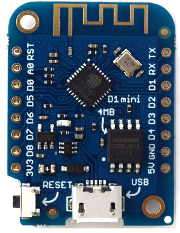
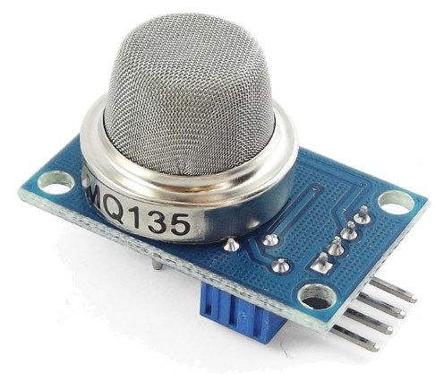

# Air Quality Wifi Node
## An ESP8266 [Wemos D1 Mini](https://wiki.wemos.cc/products:d1:d1_mini) based air quality sensor node
### Hardware needed
- Wemos D1 Mini 
- MQ-135 sensor

## Built with

- [Visual Studio Code](https://code.visualstudio.com/)
- VSCode [Arduino Plugin](https://marketplace.visualstudio.com/items?itemName=vsciot-vscode.vscode-arduino)
